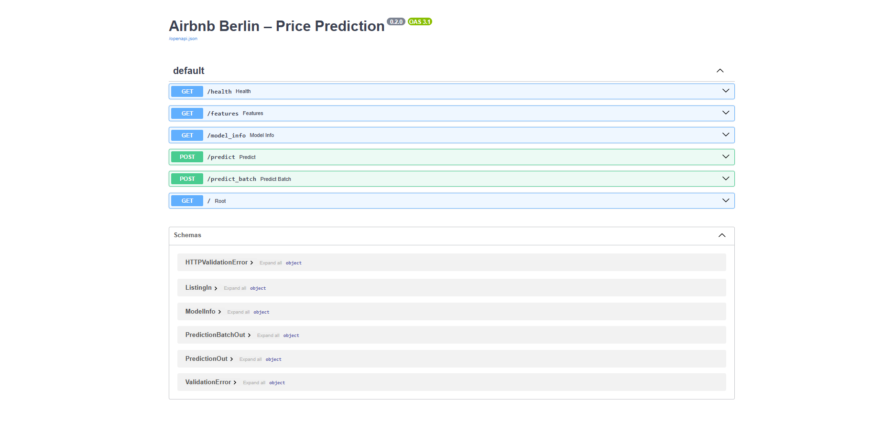
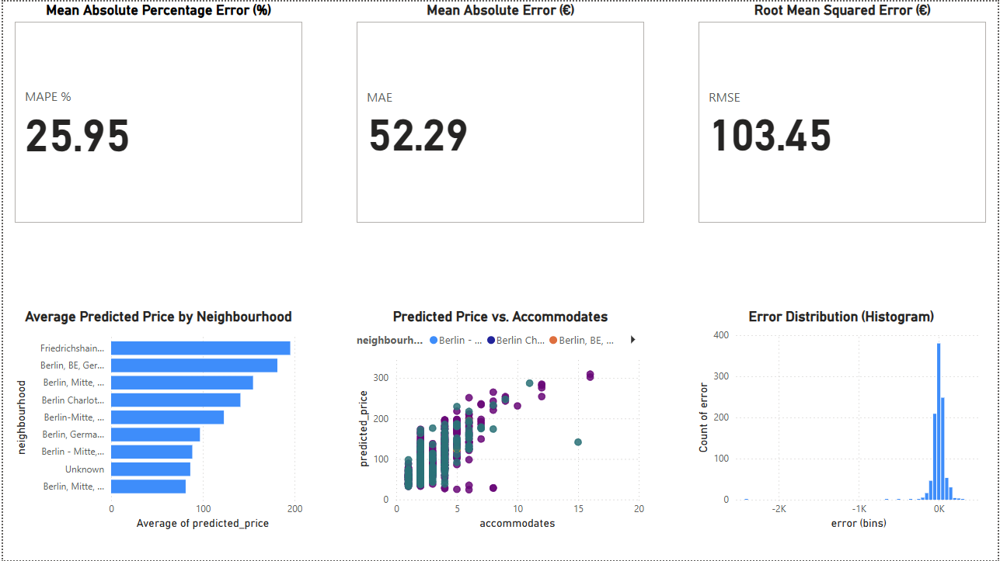

# Airbnb Price Prediction — Berlin 🇩🇪

End-to-end ML service (Clean → Train → Serve) with **FastAPI** and **Docker**.  
Built to showcase **ML engineering** skills for a **Working Student (Data/ML)** role in Germany.

[](https://github.com/soukainaelhafif/airbnb-price-prediction/actions/workflows/ci.yml)
[](https://github.com/soukainaelhafif/airbnb-price-prediction/actions/workflows/publish.yml)
[](LICENSE)

**Quick links:**  
- **API docs (Swagger):** http://127.0.0.1:8000/docs (after starting the API)  
- **Health:** http://127.0.0.1:8000/health
- **Business report (PDF):** [reports/airbnb_dashboard.pdf](reports/airbnb_dashboard.pdf)

<p align="center">
  
  &nbsp;&nbsp;&nbsp;
  
</p>

---

## What’s inside
- **Data pipeline**: `src/clean.py` to turn InsideAirbnb listings into a compact feature table.
- **Model training**: `src/models/train.py` builds a scikit‑learn pipeline (impute → scale/one‑hot → RandomForestRegressor) and saves artifacts with metadata.
- **API service**: `src/api/__init__.py` exposes `/health`, `/features`, `/predict`, `/predict_batch` with **FastAPI** and Pydantic validation.
- **Tests**: `tests/` with unit tests for cleaning, training, and API endpoints.
- **Docker**: `Dockerfile` + `docker-compose.yml` to run the API with mounted model artifacts.
- **Notebooks & Reports**: `notebooks/` for EDA/modeling; `reports/airbnb_dashboard.pbix` & `reports/airbnb_dashboard.pdf` for business insights.
- **CI/CD**: `.github/workflows/ci.yml` (pytest on push) and `.github/workflows/publish.yml` (build & push Docker image to GHCR on `main`/tags).

Data source: [Inside Airbnb — Berlin](http://insideairbnb.com/get-the-data). Add the latest `listings.csv.gz` to `data/` before running the pipeline.

---

## Repository structure
```
airbnb-price-prediction
├── data/                     # place raw listings.csv(.gz) here (gitignored)
├── models/                   # trained artifacts (gitignored, .gitkeep committed)
├── notebooks/                # 01_eda.ipynb, etc.
├── outputs/                  # sample predictions, exports
├── reports/                  # Power BI dashboard (pbix, pdf)
├── src/
│   ├── api/__init__.py       # FastAPI app (predict, predict_batch, health)
│   ├── clean.py              # data cleaning & feature engineering
│   └── models/train.py       # model training + metrics + artifact saving
├── tests/                    # pytest suite (API + cleaning + training)
├── requirements.txt
├── docker-compose.yml
├── Dockerfile
└── README.md
```

---

## Getting started (local)

### Prerequisites
- Python 3.11+
- (optional) Docker 24+ if you want to run the API in a container

### 1) Create and activate an environment
```bash
python -m venv .venv
source .venv/bin/activate        # Windows: .venv\Scripts\activate
python -m pip install --upgrade pip
pip install -r requirements.txt
```

### 2) Add data
Download the latest **InsideAirbnb Berlin** `listings.csv.gz` and place it under `data/`. Example path: `data/listings.csv.gz`.

### 3) Clean data → features
```bash
python -m src.clean --in data/listings.csv.gz --out data/berlin_clean.csv
```

### 4) Train a baseline model
```bash
python -m src.models.train --data data/berlin_clean.csv --out models/baseline.joblib
# Writes metrics to models/baseline.joblib.meta.json
```

### 5) Run the API
```bash
# Set env vars first (Windows PowerShell)
$env:MODEL_PATH="models\baseline.joblib"
$env:META_PATH="models\baseline.joblib.meta.json"

# macOS/Linux
export MODEL_PATH=models/baseline.joblib
export META_PATH=models/baseline.joblib.meta.json

# Start API
uvicorn src.api:app --host 0.0.0.0 --port 8000
# Open interactive docs:
# http://127.0.0.1:8000/docs
```

---

## Run with Docker

### Option A) docker‑compose (recommended)
1. Create `.env.docker` with these lines:
```
MODEL_PATH=/models/baseline.joblib
META_PATH=/models/baseline.joblib.meta.json
```
2. Put your trained files into `./models/`.
3. Start:
```bash
docker compose up --build
# API -> http://localhost:8000  (docs: /docs, health: /health)
```

### Option B) raw docker
```bash
docker build -t airbnb-api:latest .
docker run -p 8000:8000 -v "$PWD/models:/models"   -e MODEL_PATH=/models/baseline.joblib   -e META_PATH=/models/baseline.joblib.meta.json   airbnb-api:latest
```

---

## API endpoints

- `GET /` → basic info
- `GET /health` → status check
- `GET /features` → returns the expected feature names for prediction
- `POST /predict` → single listing
- `POST /predict_batch` → list of listings

### Example request (single `POST /predict`)
```json
{
  "room_type": "Entire home/apt",
  "neighbourhood": "Mitte",
  "accommodates": 2,
  "bedrooms": 1.0,
  "bathrooms_num": 1.0,
  "minimum_nights": 2,
  "number_of_reviews": 10,
  "reviews_per_month": 0.5,
  "availability_365": 180
}
```

### Example `curl`
```bash
curl -X POST "http://127.0.0.1:8000/predict" -H "Content-Type: application/json" -d @- <<'JSON'
{
  "room_type": "Entire home/apt",
  "neighbourhood": "Mitte",
  "accommodates": 2,
  "bedrooms": 1.0,
  "bathrooms_num": 1.0,
  "minimum_nights": 2,
  "number_of_reviews": 10,
  "reviews_per_month": 0.5,
  "availability_365": 180
}
JSON
```

### Feature schema (as used in tests & API)
- `room_type` *(categorical)*
- `neighbourhood` *(categorical)*
- `accommodates` *(int)*
- `bedrooms` *(float)*
- `bathrooms_num` *(float)*
- `minimum_nights` *(int)*
- `number_of_reviews` *(int)*
- `reviews_per_month` *(float)*
- `availability_365` *(int)*

---

## Tests
```bash
pytest -q
```
The suite includes:
- cleaning helpers/unit conversions
- training routine & metric reporting
- API contract (health, features, predict, predict_batch)

---

## Metrics & model card
Training writes metrics to `models/baseline.joblib.meta.json`. Suggested to log:
- `rmse`, `mae`, `r2` on a hold‑out set
- feature importance (e.g., via permutation importance)
- training date & data snapshot hash

**Tip**: Add a short “Model Card” section (data period, leakage checks, known limitations, and fairness notes).

---

## Data cleaning details (high level)
- Normalize currency fields (e.g., `"€1.234,56"` → `1234.56`)
- Handle missing values with `SimpleImputer`
- Categorical `OneHotEncoder`, numeric scaling
- Remove extreme outliers by IQR or domain rules (optional)

---

## Exporting predictions
To generate an Excel with predictions:
```bash
python -m src.export_to_excel --in data/berlin_clean.csv --model models/baseline.joblib --out outputs/airbnb_predictions.xlsx
```
(See `outputs/airbnb_predictions_sample.xlsx` for format.)

---

## Roadmap (nice‑to‑have for job applications)
- [ ] Add a small **Streamlit** UI to demo pricing interactively
- [ ] Pin Python + pip tools in `requirements.txt`/`pyproject.toml`
- [ ] Add pre‑commit (black, isort, ruff) and type checks (mypy)
- [ ] Publish a Docker image to GHCR and link badge
- [ ] Add CI steps: lint → tests → build image
- [ ] Add **Makefile** or `taskfile` with common commands
- [ ] Add dataset download script for reproducibility
- [ ] Write a **Model Card** (`reports/model_card.md`)

---

## License
MIT — see `LICENSE`.


---

## Example Metrics (Baseline Model)
From `models/baseline.joblib.meta.json` (hold-out test data):

- RMSE: **73.63**
- MAE: **41.21**
- R²: **0.47**
- n_train: **5678**
- n_valid: **1420**

*Metrics above are from the latest local training run; values change when retrained with a new snapshot.*


---

## About Me
Hi!  
I’m applying for **Working Student (Data Science / Machine Learning)** positions in Germany.  
This project demonstrates my practical skills in:

- Data cleaning & feature engineering  
- Modeling with scikit-learn  
- API development with FastAPI  
- Containerization with Docker  
- Automated testing with pytest  

**Contact:**  
- Name: *[Soukaina Elhafif]*  
- Email: *[souka.elhafif@gmail.com]*  
- GitHub: [https://github.com/soukainaelhafif](https://github.com/soukainaelhafif)
