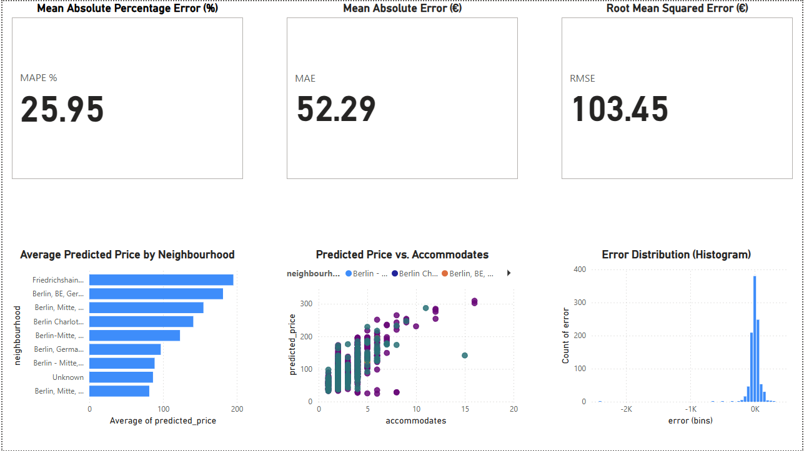

# Airbnb Price Prediction (Berlin)
[](https://github.com/soukainaelhafif/airbnb-price-prediction/actions/workflows/ci.yml)

End-to-end Machine Learning project to predict Airbnb prices in Berlin using Python, scikit-learn, FastAPI, Streamlit, and Docker.

## Project Structure
- `data/` → contains the dataset (listings.csv.gz from InsideAirbnb Berlin)
- `notebooks/` → Jupyter notebooks for EDA and model building
- `src/` → source code for training, API, and deployment
- `tests/` → pytest unit tests (data + API)
- `models/` → trained artifacts (gitignored)
- `README.md` → project description

## Goals
- Perform data cleaning and exploratory data analysis (EDA)
- Build **regression** models to predict Airbnb prices
- Deploy model as an API (FastAPI)
- Create interactive dashboard (Streamlit) *(roadmap)*
- Package with Docker & setup CI/CD (GitHub Actions)

## Tech Stack
- Python (pandas, numpy, scikit-learn, matplotlib, seaborn)
- FastAPI (API)
- Docker (containerization)
- GitHub Actions (CI/CD)

## Power BI Dashboard

- **PDF**: `reports/airbnb_dashboard.pdf`  
- **PBIX** (if available): `reports/airbnb_dashboard.pbix`  
- **Preview**:   

**KPIs**  
- **MAPE %** = Average( |error| / |price| ) × 100  
- **MAE (€)** = Average( |error| )  
- **RMSE (€)** = Square root( Average( error² ) )  

**Charts**  
- Average predicted_price by neighbourhood  
- Predicted price vs. accommodates (colored by neighbourhood)  
- Error distribution (histogram)  

## Run with Docker

### 0) Prepare env file (container paths)
```powershell
Set-Content .env.docker @'
MODEL_PATH=/models/baseline.joblib
META_PATH=/models/baseline.joblib.meta.json
'@

